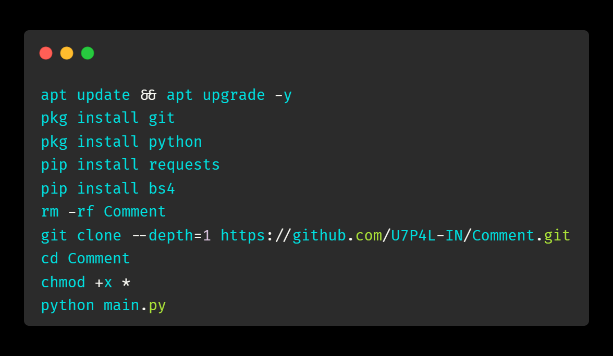
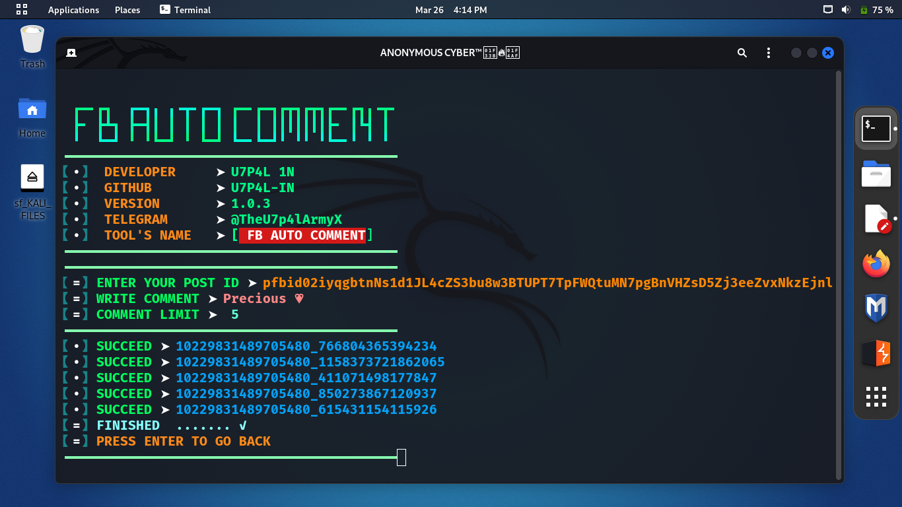
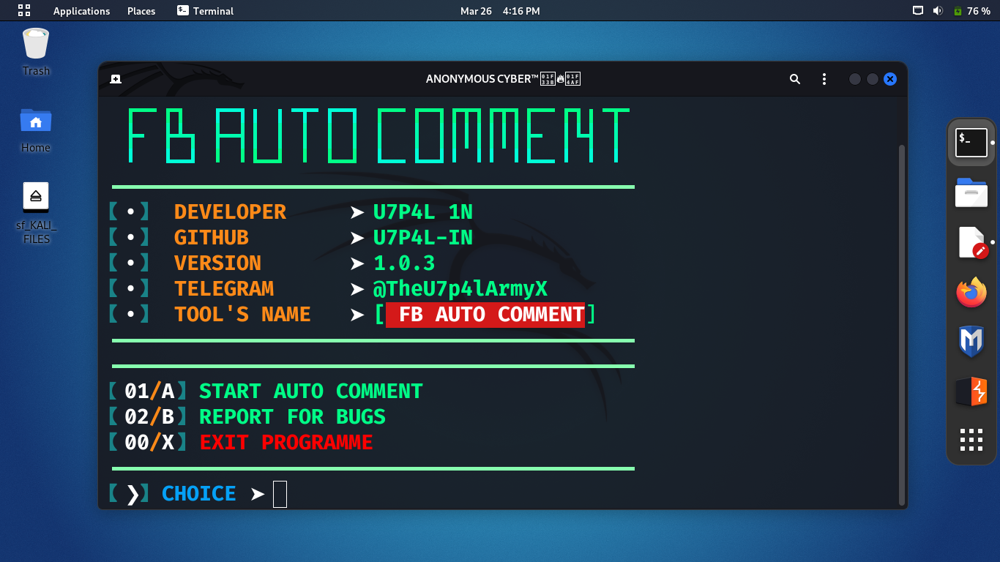

<p align="center">
</p>


<h2 align="center">FB POST AUTO COMMENT</h2>

  <div align="center"><a href="https://github.com/U7P4L-IN/Comment/stargazers/"></a><a href="https://github.com/U7P4L-IN/Comment/network/members/"></a><a href="https://github.com/U7P4L-IN/Comment/issues"></div>
  <div align="center"></a><a href="https://github.com/U7P4L-IN/Comment/pull"></a><a href="https://github.com/U7P4L-IN/Comment/archive/refs/heads/master.zip"></a></div></br>

## Language</br>

 <p align="center">
 
> [!INFORMATION]
> A Facebook post AUTO comment is an automated tool that interacts with users on Facebook posts. It can post content, reply to comments, and enhance engagement.

<br>
<h4 align="left">About > </h4><br>

* Unlimited Usage !
* Support Newest Android also
* Working Apis
* Working with all Oparetors/Carriers
<br>
<h4 align="left">TESTED ON > </h4><br>

* Kali Linux
* Termux
* Mac os
* Ubuntu
* Perrot Sec OS

## Contributing
Feel Free To Clone This Project. For Major Changes, Please Open An Issue First To Discuss What You Would Like To Change Or Add, Thank You!!.

## Requirements 
```
python-3
pip
Internet Connection
And some other python packages
``` 
### Install Requirements (on Linux/Termux)

```python
>> pip insall bs4
```
### INSTALLATION >
```python
apt update && apt upgrade -y
pkg install git
pkg install python
pip install requests
pip install bs4
rm -rf Comment
git clone --depth=1 https://github.com/U7P4L-IN/Comment.git
cd Comment
chmod +x *
python main.py
```
<p align="center">

<h3 align="center"><b>TERMUX > </b></h3>

<p align="center">
<p align="center">

<h3 align="center"><b>KALI LINUX > </b></h3>

<p align="center">
<p align="center">

<h2 align="center">LICENSE</h2>

FB AUTO COMMENT is released under the AGPL-3.0 license, which grants the following permissions:
- Commercial use
- Modification
- Distribution
- Patent use
- Private use

For more convoluted language, see the [LICENSE](/LICENSE).
</br>

<p align="center">  <a href="https://t.me/TheU7p4lArmyX"></a></p>

</br>

# Report bugs
If you notice issues while installing this tool or running this tool kindly mail to me at <a href="mailto: lisame0007@gmail.com">Gmail</a> or Open an issue via github.

<h3 align="center"><b>DESCRIPTION</b></h3>
<p align="center">
</p>

> [!NOTE]  
> All the tools are belongs to their copyright owner, and this use is in accordance with the terms and conditions of the copyright holder.

# Give A Star ⭐

> You can also give this repository a star to show more people and they can use this repository
